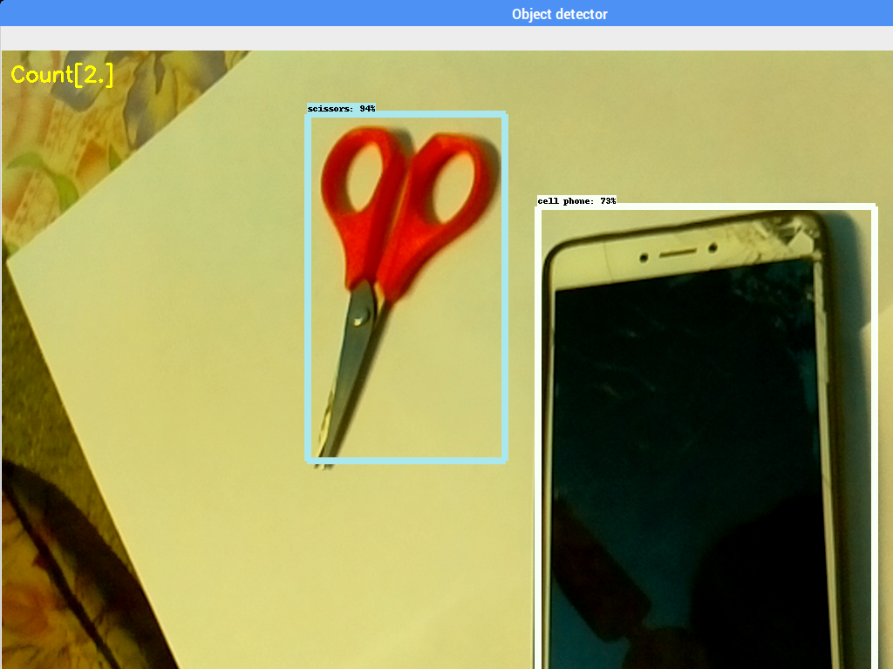

# Object-counting-using-tensorflow-on-raspberry-pi

  

## Introduction
The file "object_counting.py" helps you to detect and count the number of objects in the frame.

Here we use tensorflow classifier for object detection and counting on the raspberry pi 3 B+.

The tutorial to set up tensorflow object detection api on the raspberry pi will be given below.

https://github.com/EdjeElectronics/TensorFlow-Object-Detection-on-the-Raspberry-Pi/blob/master/README.md
